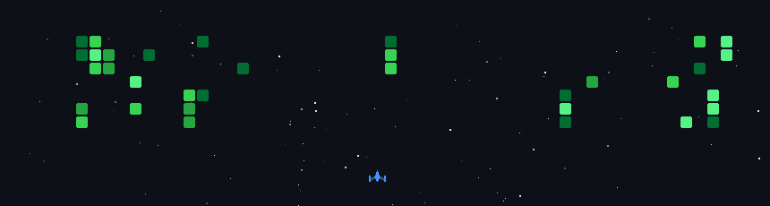

  

  

  
  
  

## ⚡ About Me

- 🎓 Computer Science & Engineering graduate from **American International University-Bangladesh (AIUB)**
- 💼 Full Stack Web Developer with hands-on experience in **React, Node.js, Express.js, MongoDB, JavaScript, TypeScript & Tailwind CSS**
- 🏢 Completed my internship as a **Full Stack Web Developer** at **PAP International Ltd.**
- 🔬 Passionate about research — currently expanding into **Software Quality Assurance**, building a strong foundation in manual testing and automation
- 🧠 My development background helps me spot issues before software ever ships

 

## 🛠️ Tech Arsenal

**Languages & Core**
 

**Frontend**
 

**Backend & Database**
 

**Tools & Platforms**
 

**QA & Testing**
 
 

 

## 📊 GitHub Analytics

## 🎮 Contribution Playground

  
    
  

## 📬 Get in Touch

 

  <i>Thank You!</i>

